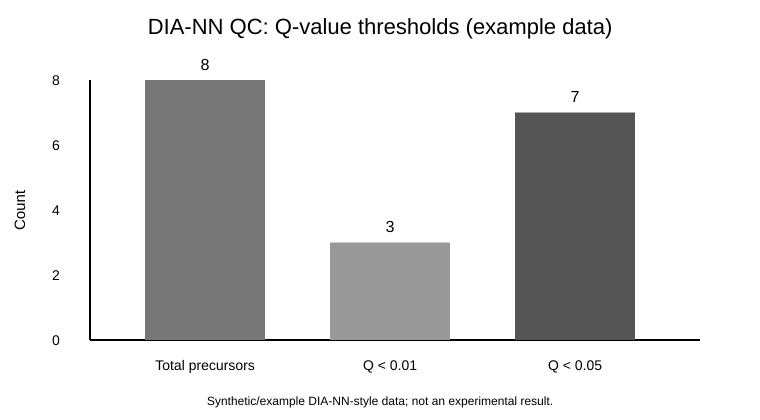

# DIA-PASEF Computational Proteomics Analysis

## Overview

This portfolio project documents a computational proteomics workflow involving DIA-PASEF, DIA-NN output processing, crosslinking mass-spectrometry context, FASTA/spectral-library preparation, QC review, and reproducible reporting.

The **public repository is a reproducible demonstration of selected downstream post-processing and QC components**. It does not include raw mass-spectrometry data, the original lab environment, or a full public reproduction of DIA-PASEF acquisition processing, XL-MSDigger rescoring, spectral-library generation, or FASTA-curation workflows.

## Public Repository Scope

The public demo includes:

- DIA-NN parquet-to-CSV/TSV conversion;
- CSV/TSV input validation;
- Q-value threshold summaries;
- Q-value percentages and distribution summaries;
- protein/gene/precursor counts;
- quantity summaries and missing-value diagnostics;
- generated QC visualization;
- committed reproducible example outputs;
- pytest-based tests;
- GitHub Actions CI;
- Snakemake workflow orchestration; and
- a generic SLURM/HPC example.

The broader project context included DIA-PASEF/XL-MS datasets, FASTA curation, organism-specific spectral-library preparation, XL-MSDigger analysis, FDR/Q-value review, Linux/HPC execution, wet-lab collaboration, and automation of repetitive post-processing. Those activities are broader project experience and are not all implemented by the public scripts.

## Reproducible Example Snapshot

The included synthetic/example DIA-NN-style table contains 8 rows. Running the public QC code produces the committed snapshot below:

| Metric | Example result |
|---|---:|
| Total precursors | 8 |
| Unique protein groups | 8 |
| Unique genes | 8 |
| Q.Value < 0.01 | 3 (37.5%) |
| Q.Value < 0.05 | 7 (87.5%) |
| Median Q.Value | 0.016 |
| Mean Q.Value | 0.022875 |
| Median quantity | 87,000 |
| Mean quantity | 100,750 |
| Missing Q-values | 0 |
| Missing quantities | 0 |



Machine-readable snapshots are committed at:

```text
results/proteomics_qc_summary.csv
results/q_value_summary.json
```

These values are **software-demonstration outputs from synthetic/example data**. They are not experimental findings and should not be interpreted as evidence of DIA-PASEF study quality or biological performance.

## Data and Privacy

Raw proteomics datasets are not included because laboratory mass-spectrometry data may be large, unpublished, restricted, or lab-owned. Public-demo outputs should not be interpreted as biological findings or validation of a proteomics experiment. See `data_description.md` for dataset notes.

## Technologies

- Python, pandas, pyarrow, matplotlib
- DIA-NN output processing and Q-value/QC review
- parquet / CSV / TSV processing
- pytest and GitHub Actions
- Snakemake
- SLURM / Linux-HPC concepts
- Git / GitHub
- DIA-PASEF, XL-MS, XL-MSDigger, FASTA and spectral-library context

## Repository Structure

```text
dia-pasef-proteomics-analysis/
├── .github/workflows/ci.yml
├── README.md
├── data_description.md
├── requirements.txt
├── data/
│   └── example_diann_output.csv
├── src/
│   ├── convert_diann_outputs.py
│   ├── proteomics_qc_summary.py
│   └── visualize_qc.py
├── tests/
│   └── test_proteomics.py
├── hpc/
│   └── run_qc.slurm
├── workflow/
│   ├── Snakefile
│   └── config.yaml
├── figures/
│   └── qvalue_qc_summary.svg
├── results/
│   ├── proteomics_qc_summary.csv
│   └── q_value_summary.json
├── reports/
├── notebooks/
└── LICENSE
```

## How to Run

Create a virtual environment and install dependencies:

```bash
git clone https://github.com/Hemalatha18-bio/dia-pasef-proteomics-analysis.git
cd dia-pasef-proteomics-analysis
python -m venv .venv
source .venv/bin/activate
pip install -r requirements.txt
```

On Windows, activate with `.venv\\Scripts\\activate`.

Generate the QC summary:

```bash
python src/proteomics_qc_summary.py \
  --input data/example_diann_output.csv \
  --output results/proteomics_qc_summary.csv
```

Generate the independent Q-value summary:

```bash
python src/convert_diann_outputs.py summarize \
  --input data/example_diann_output.csv \
  --output results/q_value_summary.json
```

Generate a QC figure from the actual summary output:

```bash
python src/visualize_qc.py \
  --input results/proteomics_qc_summary.csv \
  --output figures/qvalue_qc_summary.png
```

To convert a local DIA-NN parquet output:

```bash
python src/convert_diann_outputs.py convert \
  --input path/to/report.parquet \
  --output-dir results/converted
```

Raw or restricted lab files should not be committed to this public repository.

## Tests and CI

Run the tests locally with:

```bash
pytest -q
```

The tests cover Q-value summaries, QC metric calculation, missing/non-numeric values, required-column validation, and visualization-input validation. GitHub Actions runs the suite for pull requests and pushes targeting `main`.

## Snakemake Workflow

Run the complete public-demo QC workflow with:

```bash
snakemake -s workflow/Snakefile --cores 1
```

The workflow creates the QC summary, Q-value JSON summary, and QC figure from the example input defined in `workflow/config.yaml`.

## SLURM Example

`hpc/run_qc.slurm` demonstrates how the same public-demo QC steps can be submitted on a SLURM-based HPC system. Cluster-specific modules, partitions, accounts, and environment activation should be adjusted for the target system.

## Broader Project Context

The broader project workflow included organizing DIA-PASEF and crosslinking-MS outputs, curating organism-specific FASTA databases, supporting spectral-library preparation, working with XL-MSDigger/rescoring concepts, processing DIA-NN outputs, reviewing Q-values/FDR-related metrics, automating repetitive post-processing, connecting computational outputs with wet-lab protein workflows, and preparing documentation for lab handoff.

Quantitative claims from the broader project, including time-savings estimates, are intentionally **not presented as reproducible public-demo results unless the corresponding benchmark data and code are available in this repository**.

## Limitations

- The public repository does not process raw timsTOF/DIA-PASEF acquisition files.
- It does not reproduce XL-MSDigger analysis, FASTA curation, or spectral-library generation.
- It does not include original lab data or unpublished outputs.
- Example DIA-NN-style data cannot establish experimental quality or biological validity.
- Q-value thresholds require interpretation in the context of the upstream search strategy, study design, and validation approach.

## Future Improvements

- Add Q-value and quantity distribution plots from compatible inputs.
- Improve structured logging and optional-column handling.
- Add automated report-generation options.
- Add a safe FASTA/spectral-library preparation documentation template without restricted resources.
- Pin dependency versions when a stable release snapshot is desired.

## Skills Demonstrated

This repository demonstrates computational proteomics context, Python data processing, DIA-NN output handling, Q-value/QC summarization, missing-value diagnostics, command-line tool design, input validation, visualization from generated outputs, automated testing, CI, workflow automation, reproducibility practices, and familiarity with Linux/HPC proteomics workflows.

## Author

Hemalatha Ponnam  
M.S. Bioinformatics & Computational Biology  
Saint Louis University
